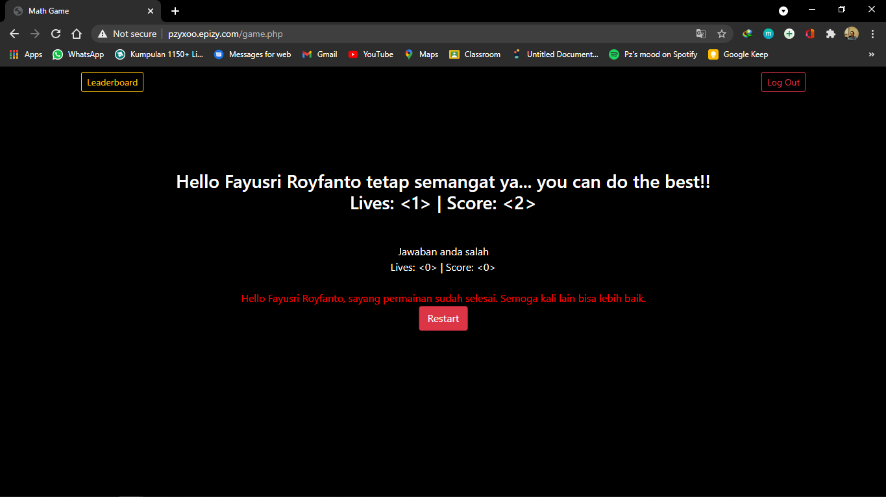

# MATH GAME BASIC - PROJECT UTS PEMROGRAMAN WEB
## Fayusri Royfanto - K3519033 

Website ini akan memunculkan sebuah game matematika dasar berupa penjumlahan kepada pengunjung. Untuk memainkan game ini, pengunjung diharuskan terlebih dahulu login pada login form yang ada. selanjutnya pengunjung akan diarahkan menuju dashboard, dan ketika pengunjung menekan tombol start game, akan diarahkan ke halaman game. pada awal game, pengunjung akan diberi 5 nyawa awal yang akan berkurang ketika salah menjawab. ketika pengunjung menjawab dengan benar, maka akan ditambahkan skor sebanyak 10. ketika salah menjawab, maka skor akan dikurangi 2 dan nyawa dikurangi 1. ketika nyawa mencapai 0, maka game akan berakhir dan pengunjung dapat memulai kembali gamenya.

 

# **Tampilan Awal Website**

# **Tampilan Setelah Login**

# **Tampilan Awal Game**

# **Tampilan Ketika Menjawab Dengan Benar**

# **Tampilan Ketika Menjawab Dengan Salah**

# **Tampilan Ketika Nyawa Sudah Mencapai 0**

# **Tampilan Leaderboard**

 

## Link Website : http://pzyxoo.epizy.com/
